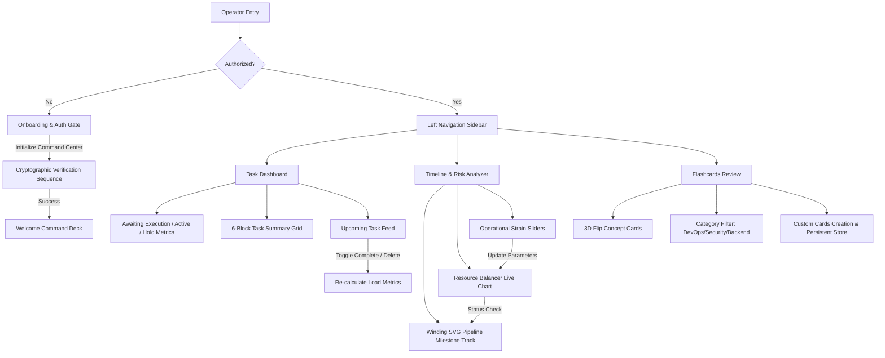

# TaskPilot.ai - Tactical Command Console

TaskPilot.ai is a next-generation, high-performance tactical task management and resource balancing dashboard. Built using a sleek, modern, flat UI design, it features a left-navigation command sidebar, a central metrics viewport, and a right calendar timeline.

---

## 📊 Application Architecture & Flow



---

## 🛠️ Key Features & Workflows

### 1. Onboarding & Authentication Gate
- **Interactive Security handshake**: Operators input credentials to start a simulated cryptographic authentication sequence.
- **Log Streaming**: An active monospaced terminal logs secure connection handshakes in real time.
- **Route Gates**: Pages like `Task Dashboard` and `Timeline & Risk` are protected by security gates. Unauthorized attempts are redirected to Onboarding.

### 2. Task Dashboard Cockpit
- **Progress Metric Cards**: Three top cards (Awaiting, Active, Hold) showing task density, stacked team avatars, and visual progress lines.
- **Task Summary Grid**: A 6-block layout showing counts of tasks in various states (Total, In Progress, Completed, High Priority, On Hold) and a clickable "+ New Data" dispatcher.
- **Interactive Upcoming Tasks**: A list of tasks featuring colored top border accents matching their status, interactive checkmarks to toggle completion, category tags, and deletion triggers.

### 3. Timeline & Risk Analyzer
- **Winding SVG Pipeline Track**: A winding S-shape tube showcasing project milestones. Nodes on the track represent milestone logs and adjust colors dynamically based on current load (Safe = Teal, Warning = Orange, Critical = Lavender).
- **Resource Balancer Chart**: A live updates bar chart displaying utilization percentages for Core Dev, Dev Ops, UI/UX, Security, and API.
- **Operational Strain Controls**: Live sliders (Scope Creep, Team Fatigue, Resource Cap) that dynamically update the Resource Balancer loads and milestone risks on the fly.
- **Simulation trigger**: Automates parameter stress variations to simulate real-time resource adjustments.

### 4. Interactive Flashcards Review Center
- **3D Card Flipping**: Spin concept cards using 3D perspective transforms to reveal answers.
- **Categorization & Pagination**: Filter cards by DevOps, Security, Backend, UI/UX, or General sectors.
- **Operator Customization**: Add custom cards that persist in browser local storage.
- **Operational Progress Tracker**: Metrics display Learned vs. Review pending count dynamically.

---

## ⚙️ Tech Stack & Dependencies

- **Framework**: [Next.js 16 (App Router)](https://nextjs.org/)
- **Core Library**: [React 19](https://react.dev/)
- **Styling**: [Tailwind CSS v4](https://tailwindcss.com/)
- **Icons**: [Lucide React](https://lucide.dev/)

---

## 🚀 Getting Started & Setup Guide

### 1. Prerequisites
Ensure you have [Node.js](https://nodejs.org/) (v20+ recommended) installed.

### 2. Installation
Clone the repository and install the dependencies:
```bash
npm install
```

### 3. Run Development Server
Start the Next.js development server locally:
```bash
npm run dev
```
Open [http://localhost:3000](http://localhost:3000) in your browser.

### 4. Build for Production
Create an optimized production bundle:
```bash
npm run build
```

---

## 🔒 Security & Exclusions Policy

To prevent security vulnerabilities and bloated commits, the following items are strictly excluded from git tracking:
- `node_modules/` - Automatically ignored. Install on-demand.
- `.next/` - Ignored Next.js production builds.
- `.env*` - Local credentials, keys, and tokens.
- `*.log` - All log streams.
- `*.db` / `*.sqlite` - Local database instances.
